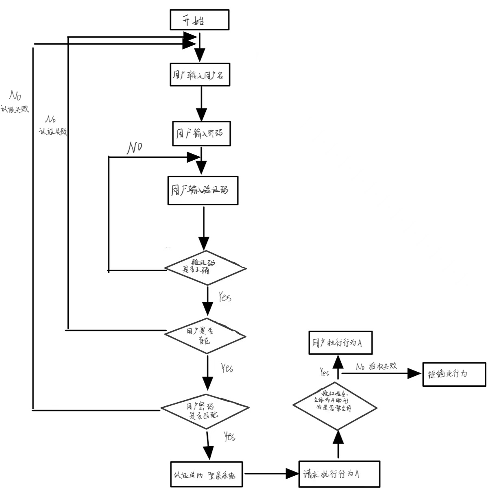
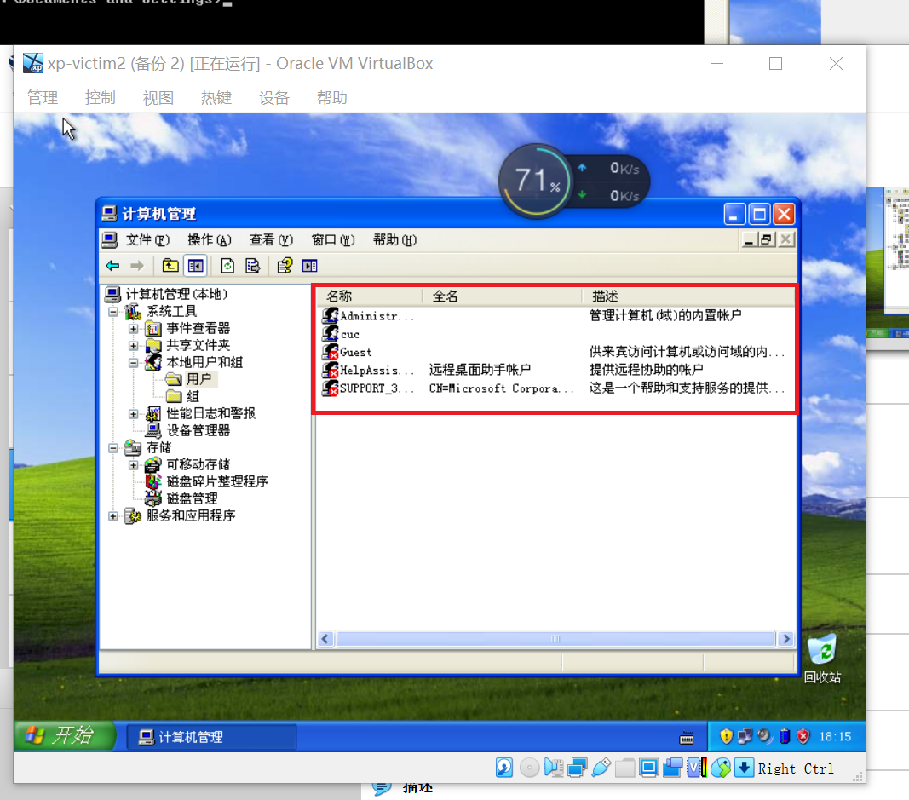
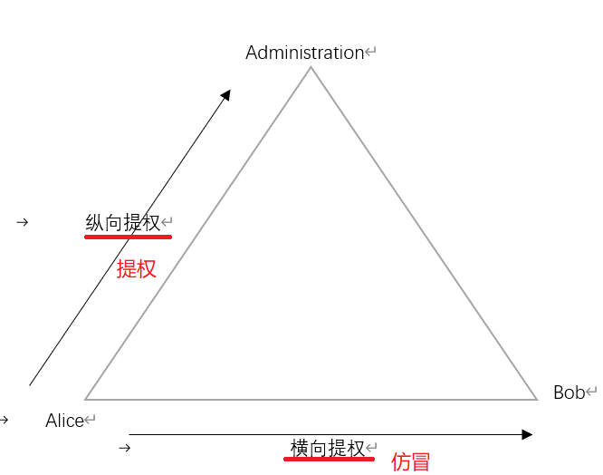
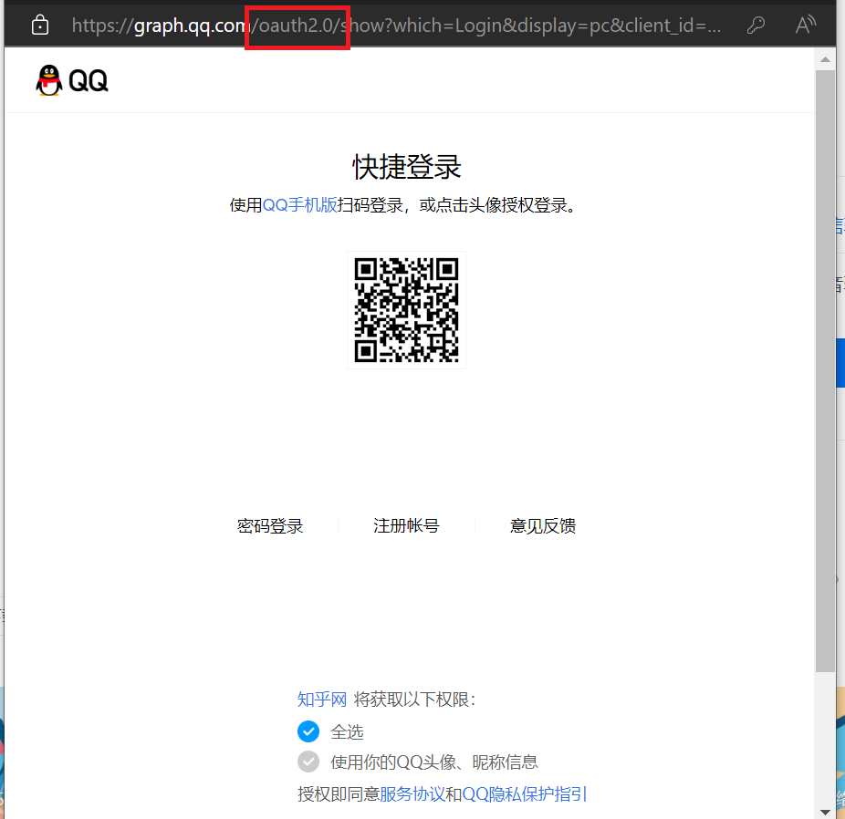

# 操作系统的访问控制设计实例研究

## 实验环境
   - 操作系统版本：Harmony OS 2.0.0
   - 硬件设备号：Honor mate30
   - 是否默认配置：是

## 实验内容及结果
- ### 以 HarmonyOS 系统作为研究对象
    - 当系统处于锁屏状态下接受到新短信时，不解锁状态下
      - 系统是否允许查看短信内容？ 
        否 （舍友无法看到短信内容，我自己（人脸识别后）看得到
      - 系统是否允许恢复短信？
        否 （解锁后也室友也看不到，因为我自己设置了指纹解锁才可以查看

     ---
    - 当系统处于锁屏状态下，使用系统内置或者第三方的语音助手可以完成以下哪些操作？
      - 访问通讯录
        否 （需要先解锁手机
      - 拨打电话
        可以
      - 访问相册
        否 （需要先解锁手机
      - 查看短信收件箱
        否 （需要先解锁手机

     ---
    - 实验分析指纹识别相较于简单密码、复杂密码、图形解锁、人脸识别解锁、声纹解锁等解锁方式的安全性、便利性差异。

    |密码类型|安全性|便利性|
    |--|--|--|
    |简单密码|安全性低，穷举即可破解密码|记忆方便，方便解锁|
    |复杂密码|安全性较高，穷举计算量大破解相对困难|不容易破解但记忆不便|
    |图形解锁|安全性取决于图像复杂程度，穷举可破解密码|画图相较于指纹繁琐|
    |人脸识别解锁|特征识别，但确保特征唯一安全性才高|较方便，解锁较快|
    |声纹解锁|容易伪造，安全性低|安静环境下说话不方便，噪音情况下识别也比较困难|
    |指纹解锁|指纹唯一性较高，复制也比较困难，安全性较高|解锁方便，但需要手指干净且干燥

- ### 思考题
  - 以上设计实现方式属于我们课堂上讲过的哪种强制访问控制模型？Lattice/BLP？Biba？
    属于 `Biba` 模型，可以 **上读下写**
    锁屏时可以读取短信属于 **上读** ，解锁后可以回复短信属于 **下写**
    
  - 系统或第三方应用程序是否提供了上述功能的访问控制规则修改？如果修改默认配置，是提高了安全性还是降低了安全性？
    提供了上述功能的访问控制规则修改。 
    修改默认配置，我认为 **安全性降低**，给予的权限越多，个人信息就会被收集得越多，安全性也会降低。

---
## 课后题

- 生物特征身份认证方式有哪些？优缺点分析？应用场景举例。
  - 虹膜识别技术
    - 优点：据宣称，每个虹膜都是独一无二的，欺骗系统困难，安全性高；便于用户使用，只需要用户位于设备之前而不需要物理的接触
    - 缺点：技术还不太成熟；成本较高，推广困难
    - 运用场景：门禁考勤系统，计算机设备登录，电子支付

  - 人脸识别技术
    - 优点：识别速度快；不需要和设备物理接触；成本低易于推广
    - 缺点：依赖环境，化妆或者脸部受伤亦或光线过强过暗均容易识别失败；容易混肴（长相相似的双胞胎识别对方设备有较大概率成功）
    - 运用场景：人脸识别门禁考勤系统，人脸识别防盗门，电子护照及身份证，计算机设备登录，电子商务（比如扫脸支付）等

  - 指纹识别
    - 优点：人体独一无二的特征，安全性高；便于用户使用，可以同时录入多个指纹
    - 缺点：需要和设备接触留下痕迹，容易被非法分子提取；识别时如果手指湿或者不干净，极大概率识别失败
    - 运用场景：电子锁，电子门禁

  - 声纹识别技术
    - 优点：不需要与设备物理接触
    - 缺点：精确度不高，易受周围环境影响，容易被窃取
    - 运用场景：电子声控，语音拨号，语音导航，实时翻译
---

- “找回口令功能”和“忘记密码”在访问授权机制中的意义？请尝试设计几种安全的“找回口令功能”，详细描述找回口令的用户具体操作过程。
  -  “找回口令功能”和“忘记密码”功能，直白来说就是在 `身份认证` 的时候证明 `我就是` ，证明通过后可以授权用户更改密码。
  - 邮箱找回口令功能分析：
    用户在注册时填写邮箱地址，将邮箱存入数据库 → 用户需要找回口令，则需要填写注册时留的邮箱，填写表单（如果输入的邮箱错误，给注册时填写的邮箱发送邮件提醒说明） → 填写表单（为防止机器人攻击，必须加上 `CAPTCHA` 识别）后提交 → 发送邮件（包括重置口令说明和申请重置密码的IP）给用户 → 用户根据邮件的验证码进行口令重置。 

  - 手机号找回口令功能分析：
   用户在注册时填写手机号码，将号码存入数据库 → 用户需要找回口令，则需要填写注册时留的手机号，填写表单（如果输入的手机号错误，给注册时填写的手机号发送短信提醒说明） → 填写表单输入防机器验证码 → 给手机发送短信 → 输入验证码 → 重置口令
---
    

- 绘制用户使用用户名/口令+图片验证码方式录系统的流程图。考虑认证成功和失败两种场景，考虑授权成功和失败两种场景。
    如图：
     

- Windows XP / 7 中的访问控制策略有哪些？访问控制机制有哪些？
  - 自主访问控制：访问列表控制
    所有用户或者用户组的权限访问设置都会被存储下来且允许随时被有修改权限的用户进行修改操作。

  - 强制访问控制： `Administrators` 组的全部成员拥有 `更改用户权限` 的权利。

  - 基于角色的访问控制：一个被授权的组分配的一个身份。在访问控制列表中，每一个用户或者用户组都对应一组访问控制项。
    
---

- 用权限三角形模型来理解并描述下 2 种威胁模型：提权、仿冒。
  参照课本，微软 `STRIDE` 模型

  |威胁|安全性属性|
  |--|--|
  |篡改|完整性| 
  |否认|不可抵赖性|
  |信息泄露|机密性|
  |拒绝服务|可用性|
  |提升权限|授权|

   - 基于角色的访问控制模型：
      - 提权：可分为纵向提权和横向提权
         纵向提权：低权限角色获取高权限角色（低 → 高）
         横向提权：获取同级别角色的权限（平移）
      - 仿冒：A 仿冒 B，那么 A 就获得了 B 的权限，但不能改变 B 的权限
      
---

- 试通过操作系统的访问控制机制来达到预防一种真实病毒的运行目的。
   - 强制访问控制 -> 防止木马病毒窃取操作权限
   - 锁定注册表 -> 防止熊猫烧香添加开机自启动项
   - 管理员正确配置权限（确保低权限用户对程序没有写入权限） -> 防止程序被病毒替换成任意可执行文件 
---  

- 什么是 OAuth？
  OAuth是一个**关于授权**（authorization）的开放网络标准，在全世界得到广泛应用。
  也就是让用户告诉系统，同意第三方应用访问自己的一部分数据,系统从而产生一个令牌来认证与授权的一种协议。例如我使用 知乎 登录时选择 QQ 方式。
  

- 什么是 OpenID？
  OpenID是一个**身份认证**协议，侧重于确定“用户是谁”，即认证用户所声称的身份是否真实。
  简单来说就是允许用户使用一个已经存在的帐号来登录多个网站，而不必创建新的密码。 

- 试用本章所学理论分析 0Auth 和 OpenID 的区别与联系。
  - 区别
  oauth2的目的用来授权，openid用来认证。openid提供对实体的鉴别，而OAuth更通用。当一个服务向第三方服务发行一个令牌可以用来访问一个被保护资源的令牌时，只要拥有令牌就能够访问其被授予的资源,而不管其身份。
  ||OAuth|OpenID|
  |--|--|--|
  |关注点|授权，即“我能做什么”|认证，即“我是谁”
  |票据格式|JSON/SAML2|JSON|
  |传输方式|HTTP|HTTP GET & HTTP POST|
  |使用场景|授权|单点登录|

  - 联系
  两者都可以实现用户的验证和授权（两者的本质都是获取断言（assertion verification method）来实现；OAuth2 是 OpenID-Connect 的基础

---
- 如何使用 OAuth 和 OpenID 相关技术实现单点登录（Single Sign On）？
  同一个账号可以登录多个应用。比如我们购物时可以使用淘宝账号来登录天猫~
  操作的实现：
  1.用户访问 A 系统，但没有登录。
  2.跳转到一个第三方的 SSO 系统，SSO 系统也没有登录，跳转到用户登录页面。
  3.用户如果使用第三方登录。SSO 让用户跳转到第三方网站，第三方网站要求用户登录，得到用户同意后使用第三方登录。
  4.第三方网站重定向回 SSO 系统，同时发回一个授权码。SSO 使用授权码，向第三方服务请求令牌，第三方5服务返回令牌，SSO 系统使用令牌，向第三方网站请求用户数据。
  5.SSO 系统进行认证后，将登录状态写入 SSO 的session，浏览器（Browser）中写入 SSO 域下的Cookie。SSO 系统登录完成后会生成一个 ST（Service Ticket），然后跳转到 A 系统，同时将 ST 作为参数传递给 A 系统。
  6.A 系统拿到 ST 系统后，从后台向 SSO 发送请求，验证 ST 是否有效。
  7.验证通过后，A 系统将登录状态写入 session 并设置A系统域下的 Cookie。
  8.当用户访问 B 系统时，B 系统没有登录，跳转到 SSO。
  9.SSO 验证用户已经为登录状态后，SSO 生成 ST，跳转到 B 系统，并将 ST 作为参数传递给 B。
  10.B 拿到 ST，后台访问 SSO，验证 ST是否有效
  11.验证成功后，B将登录状态写入 session，并在B网站的域下写入 Cookie。

## 参考文献
- [网络安全在线课本](https://c4pr1c3.github.io/cuc-ns/chap0x02/main.html)
- [what is openID?](https://openid.net/what-is-openid/)
- [OpenID 和 OAuth 的区别](https://www.zhihu.com/question/19628327)