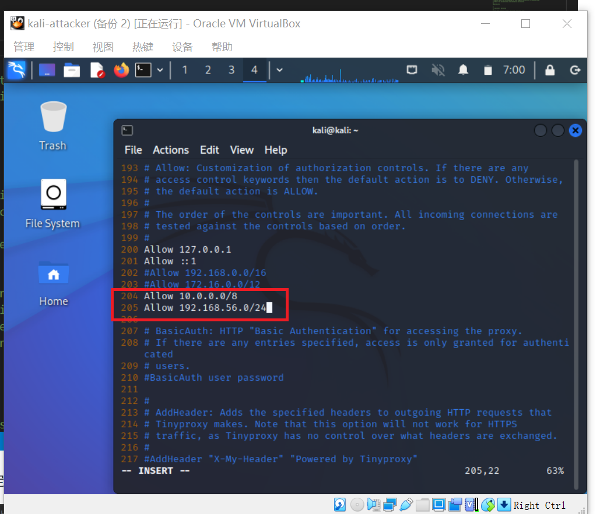
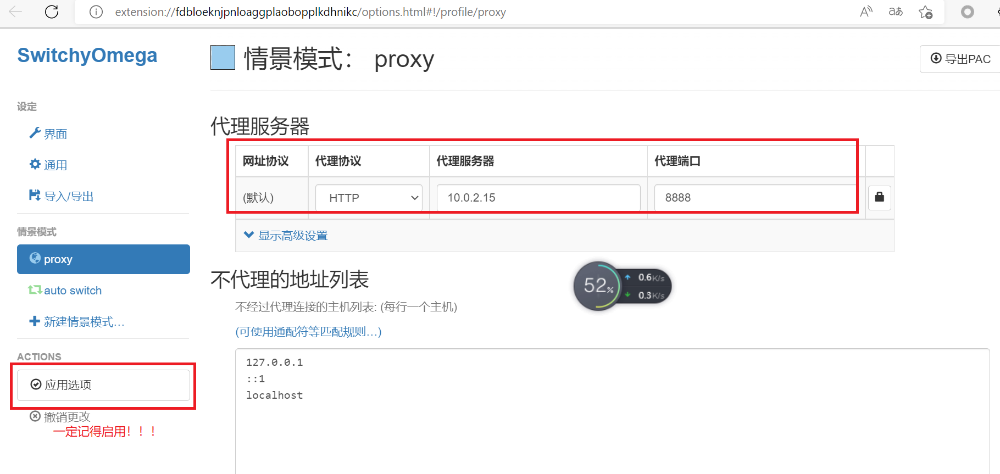
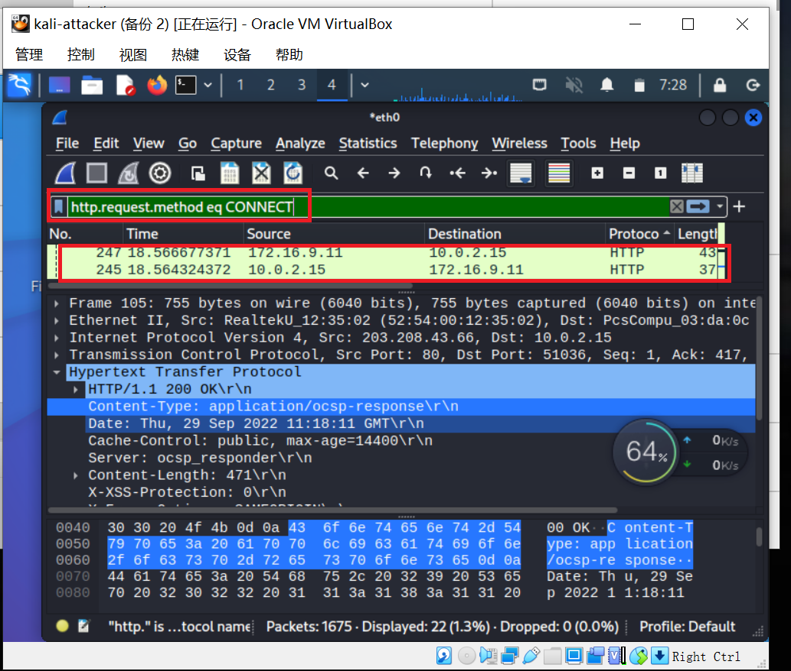
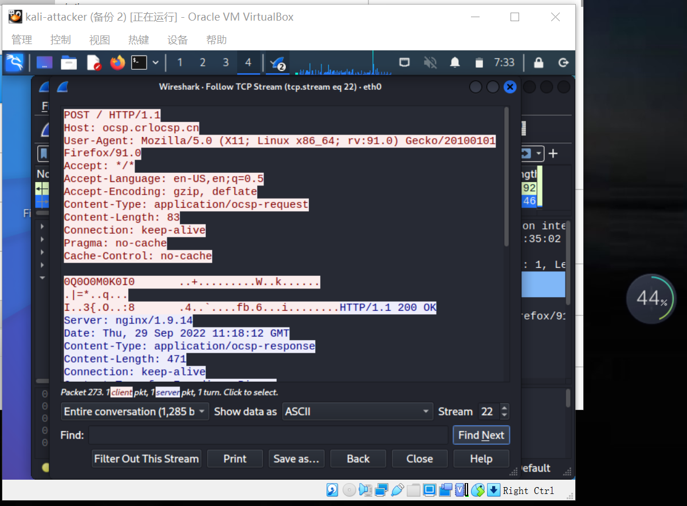
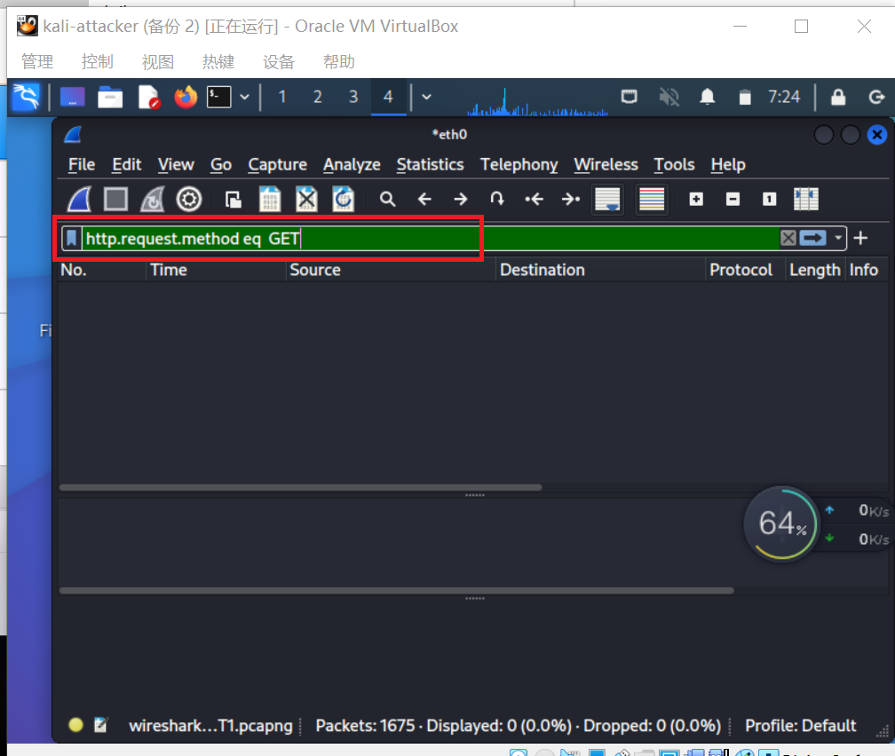
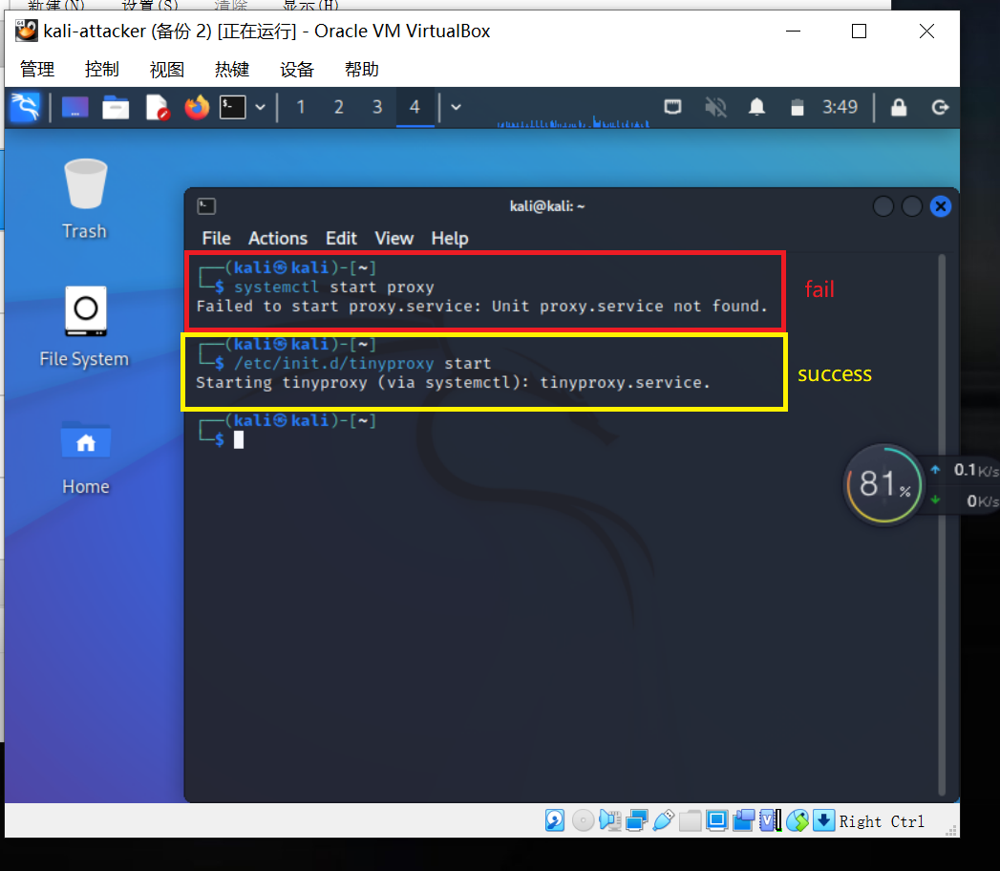

# HTTP代理服务器实验

## 实验环境
   - 主机：Windows10 
   - 虚拟机： kali-linux-2022.3 
  

## 实验内容
  ### 实验准备
- 1.1 在 kali 中安装 tinyproxy
```python
sudo apt update&&sudo apt install tinyproxy
```

- 1.2 修改 tinyproxy 配置文件，取消 `Allow 10.0.0.0/8` 的注释并且添加 `Allow 192.168.56.0/24` 实现通过host-only网卡与宿主机进行通讯的需要。
     

- 1.3 开启 tinyproxy 服务(~~忘记了就是一把辛酸泪，别问我是怎么知道的~~)\
```python
# 开启 tinyproxy 服务
/etc/init.d/tinyproxy start
```

- 1.4 设置虚拟机 kali 的联网方式为 `NAT和端口转发`，默认监听端口`8888`
      

- 1.5 主机浏览器设置代理及启动
   - 更改浏览器代理
   
   - 启动 proxy 服务
   ```python
   systemctl start proxy
   ```
   ---

   ### 实验内容
   主机访问 `https` 站点，wireshark 抓包并分析抓包结果（这里就查看 `e.cuc.edu.cn` 了
   - 2.1 使用过滤规则 `http.request.method eq CONNECT` 查看所有的 HTTPS 代理请求
     

   - 2.2 使用追踪流 -> tcp 流的方式查看详细内容
     

   - 2.3 使用过滤规则 `http.request.method eq GET` 查看是否获得 GET 代理请求
     
     没有获得GET代理请求


   ### 问题做答
   Q：使用http代理服务器访问HTTPS站点时，通信传输内容是否会被代理服务器“看到”？\
   A：结论是代理服务器不知道客户端和服务器的HTTPS通信内容，但代理服务器知道客户端访问了哪个HTTPS站点，这是由http代理的协议机制决定的：代理客户端会发送Connect请求到http代理服务器。

   ### 结论
    - 不要过于信任代理服务器的安全性
    - 代理服务器和用户之间的数据交流是 **明文传输**，所以要警惕信息泄露
    - 使用开放代理必须谨慎，避免重要数据被篡改或敏感信息被嗅探


---
## 问题及解决
- proxy 服务启动时使用 `systemctl start proxy` 时报错 `Failed to start proxy.server :Unit proxy.server not found`\
  解决方法：看了一些解决方案，主要是 “重新加载” 的方法，尝试了也没用，于是询问室友说她使用 `/etc/init.d/tinyproxy start` 命令启动服务，我一尝试果然可以，~~感谢小刘同学~~但是为什么会这样子？待解决……
  


## 课后习题
1.代理技术在网络攻防中的意义？\
(1) 对攻方的意义？\
  可以隐藏自己，绕过网络安全审查、检测机制。\
  对防守方的网络安全检测、审计机制造成威胁。\
(2) 对守方的意义？\
  通过网络代理可以加密通信数据，防止通信数据被窃听和篡改。\
  通过审查网络通信数据，进行恶意流量检测和过滤并可发现、阻止失泄密行为。\
  改变网络拓扑结构，实现跨局域网/异构网络通信或者用于安全保护等级较高的内部网络。

2.常规代理技术和高级代理技术的设计思想区别与联系？\
  联系：都是通过第三方服务来获得资源。\
  区别：高级代理技术对通信的匿名性有较高要求。

## 参考文献
- [Failed to start XXX.service: Unit not found的解决方法](https://blog.csdn.net/CN_TangZheng/article/details/111867712)
- [wireshark教程](https://unit42.paloaltonetworks.com/wireshark-tutorial-decrypting-https-traffic/)
- [黄大在线课本](https://c4pr1c3.github.io/cuc-ns/chap0x03/main.html)
- [张师哥的作业参考](https://github.com/CUCCS/2021-ns-public-Zhang1933/tree/ch0x03)