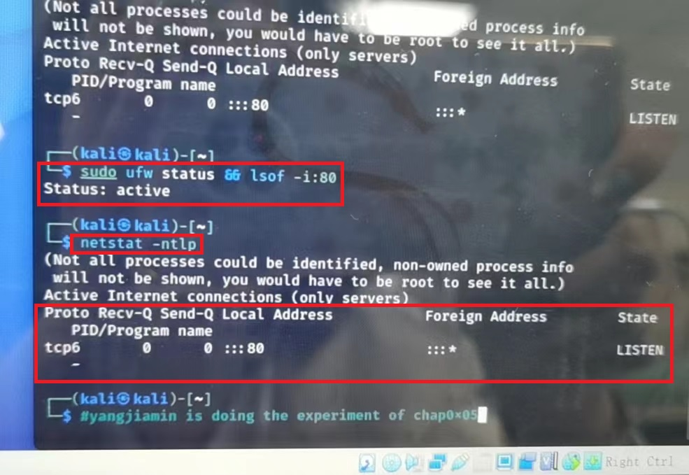
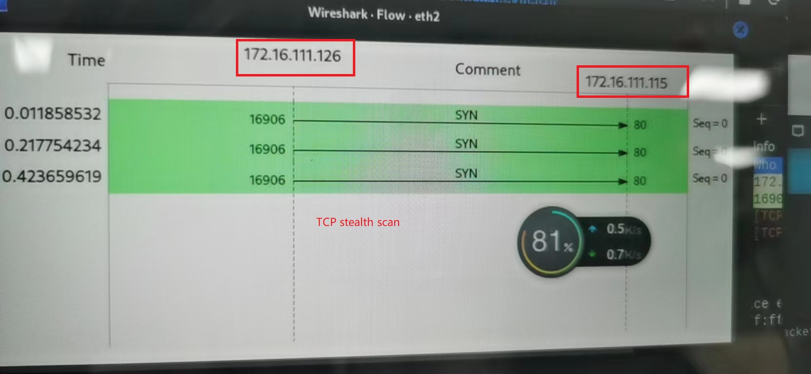
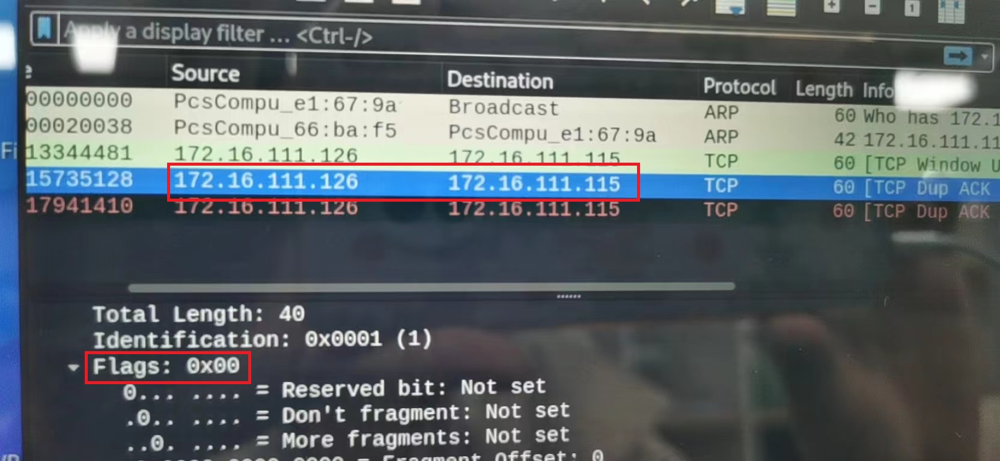

# 基于Scapy编写端口扫描器

## 实验环境
  - python 3.10
  - scapy 2.4
  - nmap 7.9
  - 网络拓扑：
    

## 实验目的
  - 掌握网络扫描之端口状态探测的基本原理

## 实验要求
  - [×]禁止探测互联网上的 IP，严格遵守网络安全相关法律法规
  - [×]完成以下扫描技术的编程实现
    - [×]TCP connect scan / TCP stealth scan
    - [×]TCP Xmas scan / TCP fin scan / TCP null scan
    - [×]UDP scan
  - [×]上述每种扫描技术的实现测试均需要测试端口状态为：`开放`、`关闭` 和 `过滤` 状态时的程序执行结果
  - [×]提供每一次扫描测试的抓包结果并分析与课本中的扫描方法原理是否相符？如果不同，试分析原因；
  - [×]在实验报告中详细说明实验网络环境拓扑、被测试 IP 的端口状态是如何模拟的
  - [×](可选）复刻 nmap 的上述扫描技术实现的命令行参数开关
---

## 环境配置
   - 配置关闭状态：对应端口未开启监听，防火墙关闭状态
   ```shell
   ufw disable
   ```
   注意： `ufw` 需要root权限，普通用户下无法使用，`sudo` 即可

   - 配置开放状态：对应端口开启监听，防火墙关闭状态
   ```shell
   systemctl start apache2 # port 80
   systemctl start dnsmasq # port 53
   ```

  - 配置过滤状态：对应端口开启监听，防火墙开启状态
   ```shell
   ufw enable && ufw deny 80/tcp
   ufw enable && ufw deny 53/udp
   ```

  - 查看端口状态
   ```shell
   ufw status
   ```
  
  - 查看内部网络1 中的所有网络
   ```shell
   nmap -sn 172.16.111.0/24
   ```
   


## 实验内容
一些说明：因为电脑风扇沙沙作响CPU拉满，每次截图就像触发了机关一样电脑直接崩掉，根本用不了，，，所以只能手机拍照，虽然像素低但能看/(ㄒoㄒ)/~~😭😰

\
1.TCP connect scan / TCP stealth scan
#### TCP connect scan
> 这种扫描方式可以使用 Connect()调用，使用最基本的 TCP 三次握手链接建立机制，建立一个链接到目标主机的特定端口上。首先发送一个 SYN 数据包到目标主机的特定端口上，接着我们可以通过接收包的情况对端口的状态进行判断。\
三种情况情况下的不同响应：\
1.接收 SYN/ACK 数据包，说明端口是开放状态的；\
2.接收 RST/ACK 数据包，说明端口是关闭的并且链接将会被重置；\
3.目标主机没有任何响应，意味着目标主机的端口处于过滤状态。

TCP connect scan 和 TCP stealth scan 都是发送 `SYN` 包，所以效果是一样的。

 - 代码实现
 ```python
 def TcpConnect(ip,port):
    """
        Open: return 1
        Closed: return 0
        No response: return -1
    """
    print("TCP connect scan:")
    print("------------------")
    pkt = IP(dst=ip)/TCP(sport = sport,dport = port,flags = "S")
    ans = sr1(pkt,retry = 2,timeout = 0.2)
    if not ans:
        return -1
    F=ans['TCP'].flags
    if F & ACK and F & SYN :
        pkt = IP(dst=ip)/TCP(sport = sport,dport = port,seq = ans.ack,ack = ans.seq+1,flags = "AR")
        send(pkt)
        return 1
    elif F & RST and F & ACK:
        return 0
    else:
        return -1
 ```

 - nmap 
 ```python
 nmap -sT -p 80 172.16.111.115
 ```

 - 效果展示
   - 端口关闭：
   
   
   - 端口开放：
   
   
   - 端口过滤：
   
   
   
   和预期结果一致~
   - nmap 实现效果：
   
   ！复刻只截取了一种情况！


#### TCP stealth scan
  - 代码实现
   ```python
   def TcpStealthy(ip,port):
     """
        Open: return 1
        Closed: return 0
        No response: return -1
     """
     print("TCP stealth scan:")
     print("------------------")
     pkt = IP(dst = ip)/TCP(sport = sport,dport = port,flags = "S") 
     ans = sr1(pkt,retry = 2,timeout = 0.2)    
     if not ans :
         return -1
     F=ans['TCP'].flags
     if F & ACK and F & SYN:
         send(IP(dst = ip)/TCP(sport = sport,dport = port,seq = ans.ack,ack = ans.seq+1,flags = "R"))
         return 1
     elif F & ACK and F & RST:
         return 0
   ```

  - nmap
   ```python
   nmap -sS -p 80 -vv 172.16.111.115
   ```

  - 效果展示
    - 端口关闭：
    
    
    - 端口开放：
    
    - 端口过滤：
    
    
    
    和预期结果一致~
    - nmap 实现效果：
    
   ---

2.TCP Xmas scan / TCP fin scan / TCP null scan
#### TCP Xmas scan
 - 代码实现
  ```python
  def TcpXmas(ip,port):
     """
        Closed: return 1
        Open or Filtered: return 0
        Else case: return -2
     """
     print("TCP xmas scan:")
     print("------------------")
     pkt = IP(dst = ip)/TCP(sport = sport,dport = port,flags = "FPU")
     ans = sr1(pkt,retry = 2,timeout = 0.2)
     if not ans :
         return 0
     F=ans['TCP'].flags
     if F & RST :
         return 1
     return -2
  ```

 - nmap
  ```python
   nmap -sX -p 80 -n -vv 172.16.111.115
  ```

 - 效果展示：
   - 端口关闭：
   
   
   - 端口开放：
   
   - 端口过滤：
   
   
   
   和预期结果一致~
   - nmap 实现效果：
   
   ---

#### TCP fin scan 
 - 代码实现
  ```python
  def TcpFin(ip,port):
     """
       Closed: return 1
       Open or Filtered: return 0
       Else case: return -2
     """
     print("TCP fin scan:")
     print("------------------")
     pkt = IP(dst = ip)/TCP(sport = sport,dport = port,flags = "F")
     ans = sr1(pkt,retry = 2,timeout = 0.2)
     if not ans:
         return 0
     F=ans['TCP'].flags
     if F & RST:
         return 1
     return -2 
  ```

 - nmap
  ```python
   nmap -sF -p 80 -n -vv 172.16.111.115
  ```

 - 效果展示：
   - 端口关闭：
   
   
   - 端口开放：
   
   - 端口过滤：
   
   
   
   和预期结果一致~
   - nmap 实现效果：
   
   ---

#### TCP null scan
 - 代码实现
 ```python
 def TcpNull(ip,port):
    """
       Closed: return 1
       Open or Filtered: return 0
       Else case: return -2
    """
    print("TCP null scan:")
    print("------------------")
    pkt = IP(dst = ip)/TCP(sport = sport,dport = port,flags = "")
    ans = sr1(pkt,retry = 2,timeout = 0.2)
    if not ans:
        return 0
    F=ans['TCP'].flags
    if F & RST:
        return 1
    return -2 
 ```

 - nmap
  ```python
   nmap -sN -p 80 -n -vv 172.16.111.115
  ```

 - 效果展示：
   - 端口关闭：
   
   
   - 端口开放：
   
   
   - 端口过滤：
   
   
   
   和预期结果一致~
   - nmap 实现效果：
   
 ---

3.UDP scan
首先开启 `dns` 服务
```shell
systemctl start dnsmasq
```

 - 代码实现
 ```python
 def UdpScan(ip,port):
    """
        Closed: return 1
        Open: return 0
        Filtered: return -1
        Open or Filtered: return -2
    """
    print("UDP scan:")
    print("------------------")
    pkt = IP(dst = ip)/UDP(sport = sport,dport = port)
    ans = sr1(pkt,retry = 2,timeout = 0.2)
    if not ans:
        return -2
    if ans.haslayer(UDP):
        return 0
    if ans.haslayer(ICMP):
        if int(ans.getlayer(ICMP).type)==3 and  int(ans.getlayer(ICMP).code)==3:
            return 1
        if int(ans.getlayer(ICMP).type)==3 and  int(ans.getlayer(ICMP).code) in [1,2,9,10,13]:
            return  -1
    return -3
 ```

 - nmap
  ```python
   nmap -sU -p 53 -n -vv 172.16.111.115
  ```

 - 效果展示：
   - 端口关闭：
   
   
   - 端口开放：
   
   
   - 端口过滤：
   
   
   和预期结果一致~
   - nmap 实现效果：
   


## 问题及解决
  - `nmap` 需要在 `root` 用户下使用，`su` 不能解决问题\
     解决方法：需要在启动页面的 `linux` 后面添加 `rw single init =/bin/bash`，根据提醒输入 root 明明并确认，重启后即可使用 root 登录
     
  - `python` 和 `ufw` 权限不足无法运行\
     解决方法：使用 `sudo` 提权即可 

## 参考文献
- [黄大在线课本](https://c4pr1c3.github.io/cuc-ns/chap0x05/main.html)
- [scapy文档](https://scapy.readthedocs.io/en/latest/usage.html)
- [root的创建](https://blog.csdn.net/m0_54899775/article/details/122461305)
- [tcpdump 和 Wireshark](https://blog.csdn.net/weixin_42319496/article/details/125942749)
- [许泽林师哥的作业](https://github.com/CUCCS/2021-ns-public-EddieXu1125/tree/chap0x05)